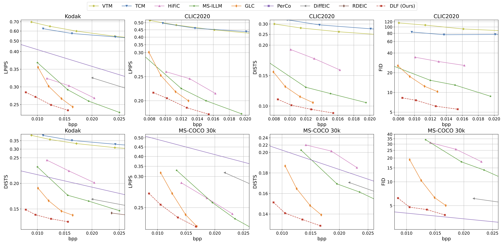

## DLF: Extreme Image Compression with Dual-generative Latent Fusion
### **✨ ICCV 2025 Highlight ✨**

[](https://arxiv.org/abs/2503.01428)
[](https://dlfcodec.github.io/)
[](https://www.python.org/downloads/release/python-3100/)
[](https://pytorch.org/get-started/locally/) 

Naifu Xue, Zhaoyang Jia, Jiahao Li, Bin Li, Yuan Zhang, Yan Lu

⭐ If you find DLF helpful, please consider starring this repository. Thank you! 🤗

## 📝 Abstract
Recent studies in extreme image compression have achieved remarkable performance by compressing the tokens from generative tokenizers. However, these methods often prioritize clustering common semantics within the dataset, while overlooking the diverse details of individual objects. Consequently, this results in suboptimal reconstruction fidelity, especially at low bitrates. To address this issue, we introduce a Dual-generative Latent Fusion (DLF) paradigm. DLF decomposes the latent into semantic and detail elements, compressing them through two distinct branches. The semantic branch clusters high-level information into compact tokens, while the detail branch encodes perceptually critical details to enhance the overall fidelity. Additionally, we propose a cross-branch interactive design to reduce redundancy between the two branches, thereby minimizing the overall bit cost. Experimental results demonstrate the impressive reconstruction quality of DLF even below 0.01 bits per pixel (bpp). On the CLIC2020 test set, our method achieves bitrate savings of up to 27.93% on LPIPS and 53.55% on DISTS compared to MS-ILLM. Furthermore, DLF surpasses recent diffusion-based codecs in visual fidelity while maintaining a comparable level of generative realism. Code will be available later.




## 💿 Installation

**1. Create environment & install dependencies**
```bash
conda create -n DLF python=3.10
conda activate DLF
pip install -r requirements.txt
```

Notes:
- If necessary, skip PyTorch packages in requirements.txt and install PyTorch 2.2.0 manually for your CUDA version.
- You may need to downgrade pip to v24.0.
- Installing ninja may be required for torchac compilation.

**2. Build the entropy coder for detail branch**

```bash
sudo apt-get install cmake g++
cd src
mkdir build
cd build
conda activate $YOUR_PY38_ENV_NAME
cmake ../cpp -DCMAKE_BUILD_TYPE=Release[Debug]
make -j
```

## 💻 Inference

1. Download the [pretrained models](https://1drv.ms/f/c/af332a47fcf136b4/Esyt5scWxTFGi8Lu7iSpUOEBAEQUQVoBF6ZcbfIORvdTcg)
2. Run inference script:
```bash
cd src
python test.py \
    --base_config ./config/config_test.yaml \
    --ckpt_path [checkpoint path] \
    --dataset_dir [your image folder] \
    --save_dir [output folder] \
    --gpu_idx 0
```

## 🚀 Train
1. Prepare pretrained models: [Semantic Tokenizer](https://huggingface.co/yucornetto/tokenizer_titok_l32_imagenet) and [VQGAN Tokenizer](https://1drv.ms/f/c/af332a47fcf136b4/Esyt5scWxTFGi8Lu7iSpUOEBAEQUQVoBF6ZcbfIORvdTcg)

2. Prepare dataset
  - Download [Open Images v4 dataset](https://storage.googleapis.com/openimages/web/download_v4.html) and randomly sample 400,000 images. (Other high-quality datasets or larger samples may further improve results if storage and GPU resources allow.)
  - Prepare your validation dataset.
  - Generate training/validation text lists:
    ```bash
    find [image folder] -name "*.png" > [output txt path]  # or .jpg
    ```
  - Update the training config (./src/config/train) with tokenizer paths and dataset file paths. See notes in config for more details.

3. Start training
    ```bash
    cd src
    python train.py \
      --outdir [your output path] \
      --name [your save name] \
      --base .config/train/config_qp3_256train.yaml \   # according to your need
      --gpus 0,1,2,3 
    ```
    where *qp* indicates compression level, *256* or *512* indicates training resolution.

Notes:
- Begin with 256×256 patches for faster initialization (e.g., xxx_256train.yaml).
- Then resume from the 256×256 checkpoint and continue with 512×512 training (e.g., xxx_512train.yaml) for high-resolution adaptation.
- (Optional) Finally, fine-tune pretrained semantic weights jointly with a smaller learning rate (see notes in config file).
- Adjust the lambda strategy in config to reach your target bitrate.


## 🥰 Acknowledgement
We sincerely thank the following outstanding works, which greatly inspired and supported our research:
- [An Image is Worth 32 Tokens for Reconstruction and Generation](https://yucornetto.github.io/projects/titok.html)
- [Taming Transformers for High-Resolution Image Synthesis](https://github.com/CompVis/taming-transformers)
- [DCVC family](https://github.com/microsoft/DCVC)


## 📕 Citation

If you find our work inspiring, please cite:
```bibtex
@InProceedings{xue2025dlf,
  author={Xue, Naifu and Jia, Zhaoyang and Li, Jiahao and Li, Bin and Zhang, Yuan and Lu, Yan},
  title={DLF: Extreme Image Compression with Dual-generative Latent Fusion},
  booktitle={Proceedings of the IEEE/CVF International Conference on Computer Vision (ICCV)},
  month = {Oct},
  year={2025},
}
```


## ⚖️ License

This work is licensed under the Apache 2.0 License.

